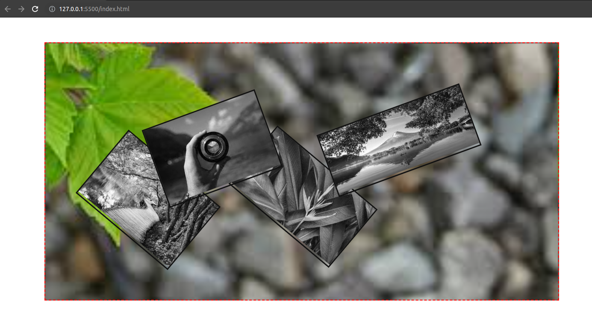

# Web-Gallery

## 

### About Project

_Webpage page gallery was created in order to practice the concept of using positioning to place elements accordingly using relative and absolute positions_

### How to use this Project

_This project can be used to design the web-gallery with different CSS concepts used here in this project mainlz relative and absolute position_.

##### Developed With

- [x] _HTML5_
- [x] _CSS3_

---

### Contact

Mail: <abadkaka@yahoo.com> 
GitHub: [ahmadshahdarwesh](https://github.com/) 

---

### Used Tools

- [Visual Studio Code](https://code.visualstudio.com/)

---

Made with ❤️ by me 😎
